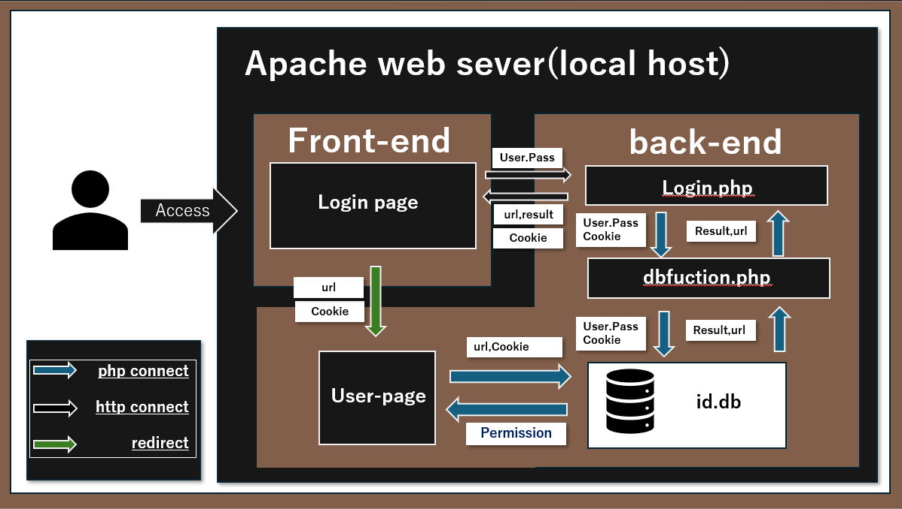
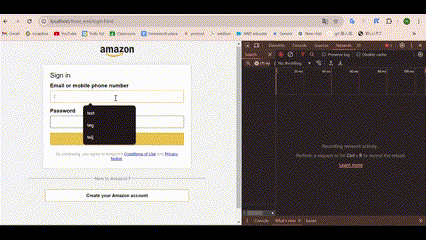
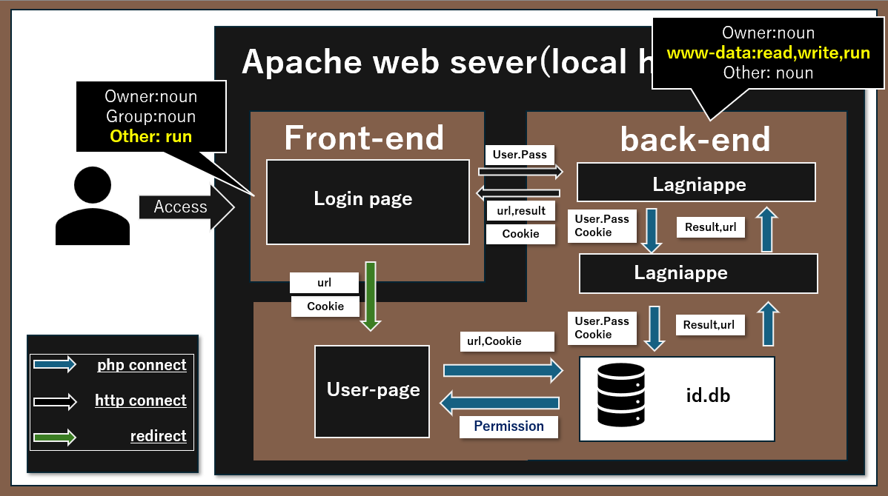

# apache-sql-login system

## 概要
Docker仮想環境でのApacheによるセキュアなログインサイト。

## 環境
- Linux 22.04.2
- Docker 26.1.1
- Apache 2.4  
    - PHP 8.0.30 
    - SQLite 3.34.1

## 要件
1. PHP,javascript,SQLiteを使う
2. Dockerで環境を構築した時点で動作可能な状態にする
3. フロントエンドとバックエンドを完全に独立させ、http通信のみ使用できるものとする。
4. フロントエンド以外の各ファイルの権限は所有者及びwww-dataが持つものとする。
5. SQLインジェクション攻撃に対する対策をする
6. 初ログイン時にクッキーを生成し、データベースに保存する。
7. ログイン後のユーザーファイルではクッキーによる権限の確認を行う。
8. ログイン、サインイン、データーベース操作の三項目でファイルを分割して作成する。
9. ルート下にapache環境確認用conf.phpを配置する。  
:::note alert
現在http通信のためgoogleのエラーが起きる可能性があります
:::
## 導入方法
1. [Dockerをインストールする](https://docs.docker.jp/desktop/install/windows-install.html "Docker install 方法")
2. Dockerfileのyour usernameに自身のユーザーネームを設定
3. 下記のコマンドを実行  
``` Linux
docker image build -t apache_sql:latest .

docker container run -d -p 任意のポート番号:80 --name apache_sql -v 絶対パス/src/:/var/www/html/ apache_sql:latest
```
4. 指定ポートにアクセス

### DBベース情報の確認方法
1. 下記のコマンドを実行しコンテナ内に入る
```
 docker exec -i -t apache_sql /bin/bash
```
2. /back_end/db/内のid.dbにアクセスする
```
sqlite3 back_end/db/id.db
```

## 設計
フロントエンドにはログイン、サインイン機能を搭載する。  バックエンドにはログイン、サインイン、DB操作を扱う。ログイン、クッキーが認証された場合、ユーザーページにリダイレクトする。
以下はシステムの概略図である。  



### 実行例  
#### Login認証

#### Signin認証

#### Cookieの発行とサイトのリダイレクト


## 学んだこと
### Cookieの設定方法
back-endで下記のコードを使用する。
``` Linux
// セッションIDを生成
session_start();
```
```
//　セッションIDを取得
$session_id = session_id();
```
```
// Cookieの詳細設定
setcookie(
    session_name(),
    //セッションIDを入力
    session_id(),
    //Cookieの有効期限の設定
    time() +設定したい時間(秒),
    '/',
    '',
    true,
    true
    );
```

この際、生成されたCookieは変数に保存しなくても、http/httpsリクエストの際に他の情報と同時に送信される。  
CookieのセッションIDは$_COOKIEにスーパーグローバル変数として保存される。(基本的には触れるべきではない)  
ログインのたびにセッションIDするには下記のコードを使用する。
```
session_regenerate_id(true);
```

### Apacheとファイルパーミッションの関係
Apache環境においてファイルに権限を付与する際、どのフィールドでそのファイルが稼働するかに注目する必要がある。下記の図の通り,
front_endにあるファイルはClientがアクセスするためotherにRead権限を付与する必要があるが、back_end内のファイルはApacheサーバーだけが実行するためWWW-dataのみにアクセス権限を付与するだけで利用できる。  
認証が必要なページリダイレクトの際も同様に、ApacheにRead権限を付与するだけで閲覧可能となる。



### SQLインジェクション攻撃の対策
下記コードを使用することで、クエリを含んだコードを文字に変換し、SQLインジェクション攻撃を防ぐことができる。また詳しいSQLインジェクション攻撃についてはsecurity attacksディレクトリに記載
```
//DBクラスの作成
$id_db = new SQLite3(データベースのパス);

//クエリの設定 例
query = "SELECT * FROM テーブル名 WHERE 列名=:変数名";
$stmt = $id_db()->prepare($query);

//クエリを文字列に変換
$stmt->bindValue(":変数名", $変数名, SQLITE3_TEXT);

//クエリの実行
$stmt->execute();

//結果を抽出
 $row = $result->fetchArray(SQLITE3_ASSOC);
```


### ApacheのConfigファイルについて
Aapcheにはconfigファイルとhtaccessファイルが存在する。  
configファイルはソースコードとは別の階層のディレクトリに配置され、主に各モジュールの有効化や、システム全体のセキュリティ設定(SSL,ファイアーウォールなど)を設定できる。対して、htaccessファイルはその設定を付与したいディレクトリ内に配置され、ディレクトリ下のアクセス制御や、URLリライト、リダイレクトの設定、パスワードによるファイル保護などをファイル単位で付与できる。

### Dockerのコマンドについて
下記のコマンドはDockerでの開発において非常に役に立つので覚えといて損はないはず。

```
//イメージを構築
docker image build
                    -t imageに名前を設定する
                    -pull　リモートレポジトリから常に最新のdockerfileを使う
                    -f dockerfileのパスを指定

//コンテナを構築
docker container run 
                    -d プロンプトの裏で実行
                    -p 開放するポート:システムが要求するポート(Dockerfileに記載)
                    --name apache_sql　containerに名前を付ける
                    -v 同期させたいローカルディレクトリのパス:同期させたい仮想環境内のディレクトリ 
                    イメージの名前

//仮想環境内のコマンドプロンプトに入る
docker exec 
                    -i　インタラクティブモードを有効化
                    -t　議事端末を割り当てる
                    コンテナの名前
                    コンテナ内のbashのパス
```

## 感想
このシステムは、Apache,PHP,SQLite,Docker,Cookieを同時に学べる開発がないかと探していたところ思いついたものである。  
開発初期は正しくアクセスの動きを把握していなかったため、どの機能をfront-end,back-endに配置させるのがよりセキュアな環境に関係していくのか知らなかった。今でも自信があるわけではないがこの開発を通して、クライアント側の視点とサーバー管理者の視点に立つことが、セキュアな環境構築に重要だということに気づいた。  
またセキュアな環境についてはこのほかにもCookie,ファイル権限の設定は非常に骨が折れた。CookieのセッションIDの保存場所がクライアントのどこにどのように送信されるのか、どの組み合わせがファイル権限の最小設定なのかは各システム・環境によって変わっていくため、いくらDockerで開発環境をフラットにしているからといえ、理解に時間を要した。  
うまくファイルを実行できないときは、権限者・グループ・必要な権限の種類・上層ディレクトリの権限が適切かを確認すべきである。  
開発の使用上front-endとback_endは同じサーバーには配置してあるが、今後はAWSにおいてサーバーを分離することでよりセキュアな環境を作る予定。ログはDockerAppに保存されているためデバックはそこを参照するといいかも知れない


